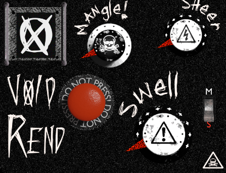
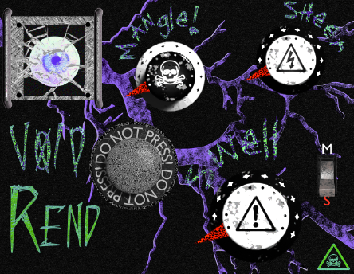

# VOID REND Final Logic Draft (UI might change)
My amazing ad:
https://www.youtube.com/watch?v=ojqvdSxlrrc
## Launched privately to friends

**All elements built and rendered by me in Blender.**

3 knobs, 2 switches

_Licenspring Authentification_

Working final draft of plugin

Added unnsmoothed compression with makeup gain to mangle so it brings out highs better

* Swell = main gain/mix + brings in light distortion [**broken mode**: increased distortion] 
* Sheer = distortion drive [**broken mode**: even more drive and hard clipping threshold] 
* Mangle = Texture + filtering + Compression [**broken mode**: f%&# up the whole sound] 
* Button = switch to **broken mode** 
* Switch = stereo/mono 

